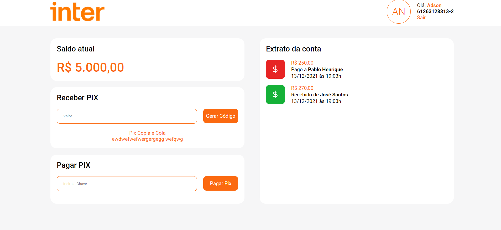

<p align="center">
  
</p>

<h1 align="center">
    
</h1>
 
<br>

## 🧪 Technologies

This project was developed using the following technologies:

- [React](https://reactjs.org)
<!-- - [Firebase](https://firebase.google.com/) -->
- [TypeScript](https://www.typescriptlang.org/)

## 🚀 Getting started

Clone the project and access the folder.

```bash
$ git clone https://github.com/adsonnovaes/dio-inter-clone-frontend.git
$ cd dio-inter-clone-frontend
```

Follow the steps below:
```bash
# Install the dependencies
$ yarn

# Start the project
$ yarn start
```
The app will be available for access on your browser at http://localhost:3000
